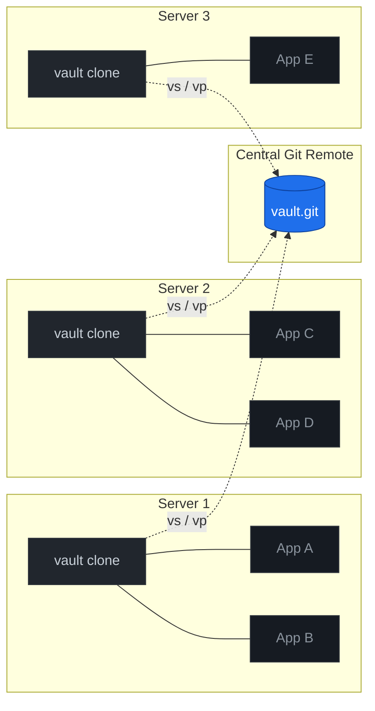

# VaultMesh

> **A multi-server LLM Wiki — turn `git` into the nervous system of your engineering org.**

VaultMesh extends [Andrej Karpathy's *LLM Wiki* pattern](https://gist.github.com/karpathy/442a6bf555914893e9891c11519de94f) from a single-user knowledge base into a **distributed wiki** that lives across N servers, each running different applications, all kept coherent through a shared, append-only, LLM-maintained markdown repository.

Every Claude Code (or any LLM agent) session, on any server, starts by pulling the wiki and ends by pushing what it learned. The wiki becomes the **shared consciousness** of the system: everyone can see what everyone else just did — without standups, Slack threads, or context-loss when teammates rotate.

---

## The 30-second pitch

**Problem.** You run a small ecosystem of services on a handful of servers. Each app has its own CakePHP / Laravel / Django / Rails repo, its own deploys, its own quirks. Cross-app integrations are documented in nobody's head, decisions get re-debated every six months, and an outage on Server 2 mystifies the engineer working on Server 4 because they had no idea Server 2 even shipped a change last Friday.

**Solution.** A single git repo — the *vault* — cloned on every server. It contains:

- One **schema** (`CLAUDE.md`) that tells every LLM session the rules of the road.
- One **wiki** (`wiki/`) of distilled markdown pages: per-app docs, integration contracts, cross-app flows, ADRs, runbooks, debugging logs.
- One **append-only log** (`wiki/log.md`) where every session reports what it touched.

The LLM does the bookkeeping. Humans curate, decide, and ship code.

**Result.** Two shell aliases — `vs` (vault-sync) at session start, `vp "msg"` (vault-push) at session end — and the entire org's recent activity is one `cat wiki/log.md | tail -50` away from any engineer on any server.

---

## Topology at a glance



Each server pulls (`vs`) at the start of a session, reads the log to know what the others have been doing, lets the LLM update wiki pages it owns, and pushes (`vp`) when done. Conflict-free by construction (see [`docs/03-ownership-model.md`](docs/03-ownership-model.md)).

---

## Quickstart

```bash
# 1. Clone VaultMesh and enter the template
git clone https://github.com/your-org/vaultmesh.git
cd vaultmesh/template

# 2. Initialize your own vault from the template
cp -r . /path/to/your/new-vault
cd /path/to/your/new-vault
git init && git remote add origin <your-central-git-url>

# 3. Edit CLAUDE.md to declare your apps and ownership rules
$EDITOR CLAUDE.md

# 4. On each server, run the bootstrap
bash <vaultmesh-checkout>/deploy/setup-server.sh path/to/server-N.conf

# 5. Reload your shell and use it
source ~/.bashrc
vs                          # pull the latest wiki state
# ... let your LLM agent edit wiki pages while you work ...
vp "myapp: document the new payment webhook"
```

A fully populated example lives in [`examples/case-study-ecommerce/`](examples/case-study-ecommerce/).

---

## What makes VaultMesh different from Karpathy's LLM Wiki

| Concern | Karpathy's LLM Wiki | VaultMesh |
|---|---|---|
| Authors | one human + one LLM | N humans + N LLM sessions across servers |
| Layers | `raw/` + `wiki/` + schema | same — plus per-app sub-schemas |
| Inter-entity contracts | implicit cross-references | explicit producer/consumer pages with breaking-changes log |
| Conflict model | not needed | scoped ownership × append-only writes ⇒ conflict-free |
| Sync | local Obsidian + optional git | central git remote + `vs` / `vp` aliases |
| Security | not addressed | pre-commit hook with secret-pattern catalog |
| Decisions | regular wiki pages | ADR workflow with a proposal stage |
| Onboarding a new server | manual | `setup-server.sh` (idempotent, 7 steps) |
| Operations | Ingest / Query / Lint | (those, plus) Sync / Push as first-class |

A side-by-side deep dive: [`docs/06-vs-karpathy.md`](docs/06-vs-karpathy.md).

---

## Who this is for

- **Small engineering orgs** with 3–10 services on 2–6 servers, where everyone wears multiple hats and nobody has time to maintain a wiki by hand.
- **Agencies** managing a stable of similar client systems — the same pattern, multiple isolated meshes.
- **Solo operators** running multiple side projects who want one source of truth across them.
- **Teams adopting Claude Code / Cursor / Aider** that want their AI sessions to compound knowledge instead of forgetting it every time the context window rolls over.

If you have one service on one server, [Karpathy's original gist](https://gist.github.com/karpathy/442a6bf555914893e9891c11519de94f) is enough — you don't need VaultMesh.

---

## Status

**v0.1 — pattern + reference implementation.** The pattern has been running in production for months on a real ecosystem (5+ apps × 4 servers) before being extracted and sanitized into this repo. What's stable:

- Repo layout, ownership model, frontmatter schema
- `setup-server.sh`, `pre-commit` hook, `vs` / `vp` scripts
- Templates and the e-commerce case study

What's experimental / on the roadmap (see [ROADMAP.md](ROADMAP.md)):

- Lint operation as a CI job (orphan detection, contradiction detection, frontmatter validation)
- Ingest tooling (Obsidian Web Clipper integration, hybrid search via [`qmd`](https://github.com/karpathy/qmd))
- A live "what's everyone working on" dashboard parsing `log.md`
- Multi-tenant variant (one VaultMesh repo, multiple isolated meshes)

---

## Documentation

| Doc | What's inside |
|---|---|
| [docs/01-concept.md](docs/01-concept.md) | Why a distributed LLM Wiki — the problem this solves |
| [docs/02-architecture.md](docs/02-architecture.md) | Three layers, N-server topology, append-only log as message bus |
| [docs/03-ownership-model.md](docs/03-ownership-model.md) | Per-app scope, producer/consumer contracts, ADR workflow |
| [docs/04-sync-protocol.md](docs/04-sync-protocol.md) | `vs` and `vp` in detail, conflict avoidance, failure modes |
| [docs/05-security-model.md](docs/05-security-model.md) | Pre-commit hook, secret patterns, blast-radius analysis |
| [docs/06-vs-karpathy.md](docs/06-vs-karpathy.md) | Side-by-side comparison with the original LLM Wiki gist |
| [docs/07-adoption-guide.md](docs/07-adoption-guide.md) | Bring this to your org in one day |

---

## Attribution

VaultMesh stands on the shoulders of two ideas:

- **Andrej Karpathy's *LLM Wiki* (2025)** — the three-layer pattern, append-only log, and "LLMs eliminate the bookkeeping burden" framing.
- **Vannevar Bush's *Memex* (1945)** — the original vision of a personal, associative knowledge store with cross-trails between documents. Karpathy himself nods to this; we extend the bow.

Full attribution and license: [ATTRIBUTION.md](ATTRIBUTION.md), [LICENSE](LICENSE).

---

## Contributing

VaultMesh is a *pattern* before it is a piece of software. The most valuable contributions are:

1. **Adoption stories** — fork it, run it, tell us what broke and what didn't.
2. **The lint operation** — see ROADMAP; this is the biggest open piece.
3. **Alternative transports** — git is the obvious default; Syncthing, S3, or a tiny HTTP API would all be interesting.

See [CONTRIBUTING.md](CONTRIBUTING.md).

---

## License

MIT. Use it, fork it, build a business on it. Just don't sue us if your wiki becomes self-aware.
