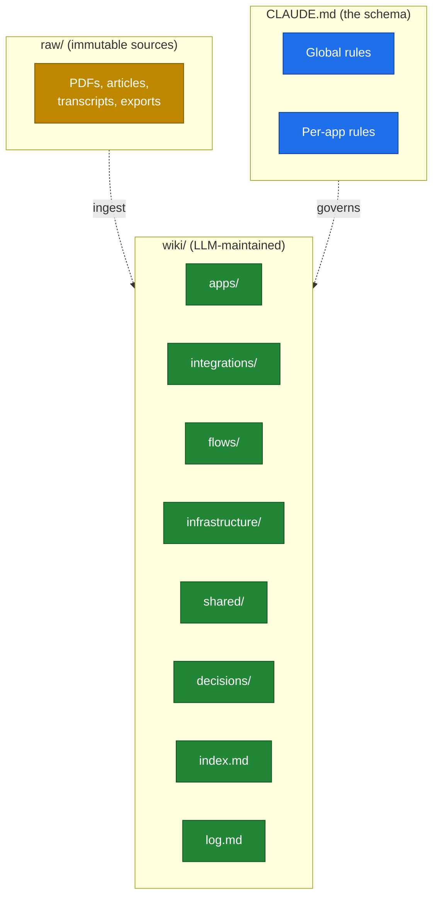
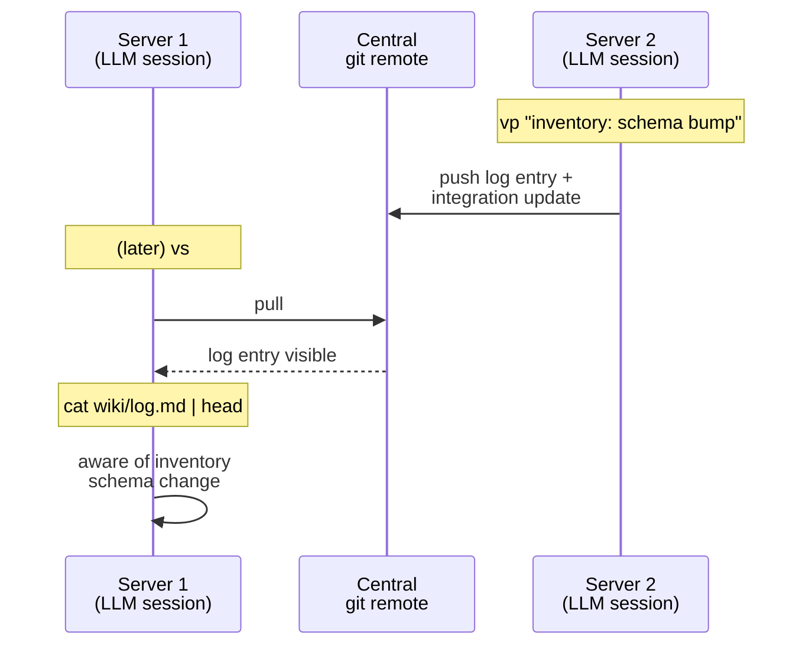

# 02 — Architecture

VaultMesh has three layers (inherited from Karpathy) and one topological twist (the mesh).

## The three layers



### Raw

Source material that the wiki distills. PDFs, articles, transcripts, data exports, screenshots. **Immutable.** The LLM reads but never modifies.

In practice, on engineering teams, `raw/` tends to be sparse — most knowledge comes from the codebase and from working sessions, not from external documents. That's fine. The folder is there when you need it (incoming RFCs, vendor PDFs, meeting transcripts).

### Wiki

The living, LLM-maintained markdown layer. Six folders plus two top-level files:

| Folder | What's in it |
|---|---|
| `apps/{app-name}/` | Per-app docs: README, modules, debugging, runbooks, proposed-adr |
| `integrations/` | Producer/consumer contracts (`NN-producer--consumer--subject.md`) |
| `flows/` | End-to-end journeys that traverse multiple apps |
| `infrastructure/` | Per-server pages (what runs where, OS, services, backups) |
| `shared/` | Cross-cutting knowledge (shared schemas, auth tokens, deployment) |
| `decisions/` | Promoted ADRs (global architectural decisions) |

Plus:

- **`index.md`** — content catalog, regenerated by lint (do not edit by hand).
- **`log.md`** — append-only session journal. The single most important file in the entire wiki.

### Schema

Two-tier:

- **`<vault-root>/CLAUDE.md`** — global rules every session must follow (ownership boundaries, frontmatter, wikilink syntax, sync protocol).
- **Per-app `CLAUDE.md`** — dropped by `setup-server.sh` into each app's working directory. Tells an LLM session started from that directory exactly what it may write to and where.

Karpathy's original has just one schema file. VaultMesh adds the per-app layer because each LLM session is, by definition, scoped to one app.

## The mesh

The twist that makes VaultMesh more than just "Karpathy's pattern in a git repo": **every server has its own clone of the vault, all pointing at one central remote**.

```mermaid
flowchart LR
    subgraph remote["Central git remote"]
        R[(vault.git)]
    end

    subgraph s1["Server 1"]
        V1[/vault clone/]
        A1["App α"]
        A2["App β"]
        V1 -. read CLAUDE.md .-> A1
        V1 -. read CLAUDE.md .-> A2
    end

    subgraph s2["Server 2"]
        V2[/vault clone/]
        A3["App γ"]
        V2 -. read CLAUDE.md .-> A3
    end

    subgraph s3["Server N"]
        V3[/vault clone/]
        A4["App δ"]
        V3 -. read CLAUDE.md .-> A4
    end

    V1 <-->|vs / vp| R
    V2 <-->|vs / vp| R
    V3 <-->|vs / vp| R

    classDef remote fill:#1f6feb,stroke:#0d419d,color:#fff
    classDef server fill:#21262d,stroke:#30363d,color:#c9d1d9
    classDef app fill:#161b22,stroke:#30363d,color:#8b949e
    classDef clone fill:#238636,stroke:#0f5223,color:#fff
    class R remote
    class V1,V2,V3 clone
    class A1,A2,A3,A4 app
```

### What sits on each server

```
Server N
├── /home/user/vault/                  ← VaultMesh clone
│   ├── CLAUDE.md
│   ├── .server-id                     ← "SERVER_ID=N"  (not in git)
│   ├── wiki/
│   ├── raw/
│   └── _templates/
│
├── /path/to/app-α/                    ← actual app source code
│   ├── CLAUDE.md                      ← scoped to app-α (dropped by setup)
│   ├── (the app's repo)
│   └── ...
│
└── /path/to/app-β/
    ├── CLAUDE.md                      ← scoped to app-β
    └── ...
```

The vault is independent of any app's repo. Apps don't depend on the vault to run. The vault depends on the apps only in the sense that a human points it at them.

## Append-only log as message bus

The single conceptual move that makes the mesh work: **the `log.md` file is treated as a message bus.**

Format:

```
## YYYY-MM-DD HH:MM — {app} on Server {N}
- modules touched: [list]
- integrations verified/updated: [list]
- notable decisions or debugging added: [list]
```

New entries go at the **top**. Anyone (human or LLM) starting a new session reads the top of `log.md` and immediately knows the recent state of every other server.

This is not a fancy data structure. It's a markdown file. The whole point is that it's so simple it can't break.



That's the whole mechanism. No queue, no broker, no topic, no consumer group, no offset tracking. Git's existing model handles all of it for free.

## Why it's conflict-free

Two design choices make conflicts virtually impossible in practice:

1. **Scoped ownership.** Server A only writes to `wiki/apps/app-α/**` (since app-α lives on Server A). Server B writes to `wiki/apps/app-γ/**`. They literally cannot edit the same file at the same time, except for the integration page where they're both involved — and that page has a strict producer/consumer split.

2. **Append-only writes.** `log.md` only grows. Two simultaneous appends from different servers will rebase cleanly because the conflict region is "where to insert" — and `git pull --rebase` resolves that by chronological ordering.

The remaining conflict source is two LLM sessions on the same server modifying the same page at the same time — which is rare in practice (you're usually running one session at a time per app) and is handled by `vs` before `vp`.

In months of production use across the reference deployment that inspired VaultMesh, the rebase-conflict count is approximately *zero*. When something does go wrong, it's almost always because someone forgot to run `vs` before starting work — and the fix is "run `vs` now and try again."

See [03 — Ownership model](03-ownership-model.md) for the full argument.

## What's deliberately missing

VaultMesh does **not** include:

- A web UI. (Use Obsidian, or any markdown previewer, or read the files in your terminal.)
- A search engine. (Use `grep`, `ripgrep`, or [`qmd`](https://github.com/karpathy/qmd) for hybrid search.)
- A backup story. (Your central git remote is the backup. Mirror it elsewhere if you're paranoid.)
- A real-time anything. (The mesh is eventually consistent on the order of one `vs` per session.)
- A multi-tenant model. (One mesh per organization. Multi-tenant is a roadmap item.)

These are not oversights. They're consequences of the design constraint: **be as simple as possible while still solving the four problems** laid out in [01 — Concept](01-concept.md). Complexity gets added back as composable side-projects, not into the core.
