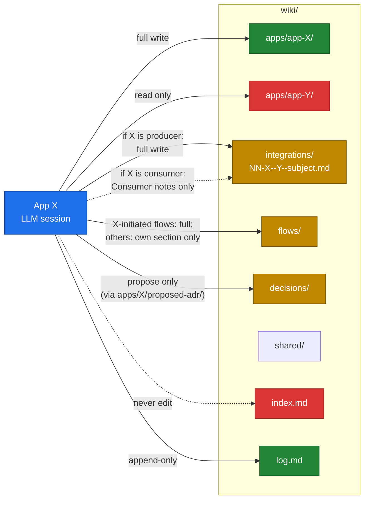
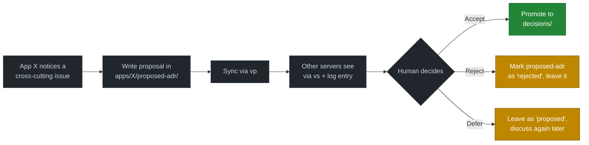

# 03 — Ownership model

The whole "conflict-free multi-author wiki" claim rests on one idea: **clear, schema-encoded write boundaries.** This page details those boundaries.

## The matrix



## The rules, prose form

### `wiki/apps/{app}/**`
**Owned exclusively by that app.** Full write. Other apps may read but not modify.

### `wiki/integrations/NN-producer--consumer--subject.md`
- The **producer** owns the page and writes everything: transport, schema, error handling, breaking-changes log.
- The **consumer** writes ONLY in the "Consumer notes" section at the bottom — observations on edge cases, deviations from spec, data interpretation.
- The "Breaking changes log" section is producer-only, no exceptions. It's how the producer signals "your read of this contract just changed; here's what you need to know."

### `wiki/flows/{flow}.md`
- Owned by the app that **initiates** the journey.
- Other apps fill in their own step sections; they do not edit the structure or other apps' sections.

### `wiki/decisions/`
- **Nobody writes here directly.** Not even the global "owner" — there isn't one.
- ADR proposals live in `wiki/apps/{app}/proposed-adr/`. A human (not an LLM) reviews, discusses, and **manually promotes** accepted proposals into `wiki/decisions/`.
- This is the one place the pattern says "stop and bring a human in."

### `wiki/shared/`
- Cross-cutting docs (shared schemas, auth tokens spec, deployment pipeline). Owned by whoever is the natural maintainer — usually the app most affected, or a designated "shared infra" owner.
- Update with care; changes here ripple across apps.

### `wiki/infrastructure/server-N.md`
- Owned by the team running that server. In practice, the apps on that server's directory are the natural owners.

### `wiki/index.md`
- **Never edited by hand.** Regenerated by lint (currently manual, lint automation is a roadmap item).

### `wiki/log.md`
- **Append-only.** Every session adds an entry at the top. No editing of past entries (if a past entry is wrong, add a correction at the top — don't rewrite history).

## Why this gives you conflict-freedom

Two app-X LLM sessions running simultaneously:

- Both write to `wiki/apps/app-X/**`. **Concurrent writes to the same file possible** → handled by `vs` before `vp`.
- Both append to `log.md`. **Concurrent appends** → `git pull --rebase --autostash` interleaves them by timestamp.

Two LLM sessions on different apps:

- App-X writes to `apps/app-X/**`, App-Y writes to `apps/app-Y/**`. **Different files. No conflict possible.**
- Both append to `log.md`. Same as above — rebase resolves it.

Two LLM sessions on different sides of the same integration:

- Producer writes to most of `integrations/NN-X--Y.md`. Consumer writes to "Consumer notes" only. **Different sections, different files? No — same file, but different regions.** Git's diff-based merge handles non-overlapping region edits cleanly. *If* both happen to edit overlapping lines (rare), the rebase fails noisily and the human resolves it.

The pattern doesn't promise *zero* conflicts. It promises *near-zero* conflicts, *loud failure when one happens*, and *a clear escalation path* (rebase fails → stop → human resolves).

## How the LLM enforces it

Three layers of enforcement, each weaker than the previous but each adding redundancy:

### 1. The schema (`CLAUDE.md`)

Every LLM session reads the global `CLAUDE.md` (in the vault root) and the per-app `CLAUDE.md` (in the app's working directory) on session start. The schema explicitly lists allowed paths and forbidden paths:

```
Allowed writes:
- wiki/apps/inventory/**            (full)
- wiki/integrations/01-*            (you are producer)
- wiki/integrations/02-*            (Consumer notes only)
- wiki/log.md                       (append-only)

FORBIDDEN:
- wiki/apps/{any-other-app}/**
- wiki/decisions/**                 (propose via proposed-adr/)
- wiki/index.md                     (regenerated by lint)
```

A well-tuned LLM follows these. The discipline is in keeping the schema accurate when the topology changes.

### 2. The pre-commit hook

If the LLM (or a human) makes a mistake and tries to commit something outside the structure, or commits something that looks like a secret, the pre-commit hook refuses. See [05 — Security model](05-security-model.md).

The hook does **not** enforce per-app ownership specifically — it enforces *structural* boundaries (path prefixes, frontmatter required, no secrets). Per-app enforcement is a roadmap item that the lint operation could implement.

### 3. The human

`vp` requires explicit confirmation. The human reads the diff before pushing. Anything truly out of bounds gets caught here.

The system is **trust-but-verify, not zero-trust**. We rely on the LLM to follow the schema 95% of the time, the hook to catch the 4%, and the human to catch the last 1%.

## The ADR proposal stage

A small but important piece: VaultMesh adds a *deliberation gate* between "I think we should do X" and "X is decided."



The reason: ADRs are organizational artifacts that affect multiple apps. An LLM session running on Server 1 should not unilaterally write to `wiki/decisions/` — that's like one engineer making a decision for the whole org. The proposal stage forces the conversation to happen *through humans*.

Promoted ADRs in `wiki/decisions/` are the constitutional law of the system. They're rare and load-bearing.

## What about cross-app changes?

Sometimes a real change touches multiple apps' wiki pages. The rule is:

> **If a change touches another app, you don't make it. You write a proposal.**

In practice:

- App X notices that integration `01-X--Y` needs a new field.
- App X **does not** edit `apps/Y/`'s pages.
- App X writes a proposal: `apps/X/proposed-adr/2026-05-add-tax-field-to-X-Y.md`.
- App X also adds a "Breaking changes log" entry on `01-X--Y` itself (because X is the producer of that contract — that's allowed).
- App Y, on its next session, sees the log entry, reads the proposal, and updates its own pages.

This is slower than just editing both. That's deliberate. The friction forces coordination.
