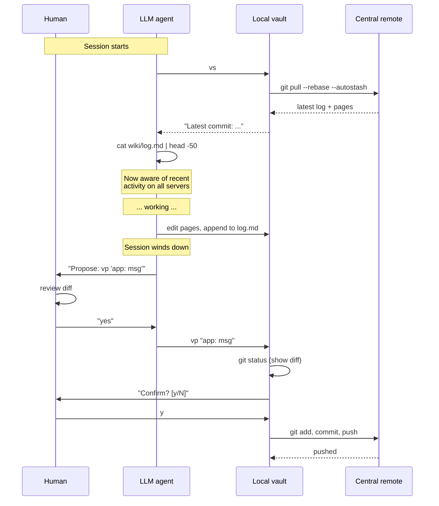

# 04 — Sync protocol: `vs` and `vp`

The two-alias workflow that turns git into a distributed message bus.

## The shape



## `vs` — vault-sync

```bash
#!/usr/bin/env bash
cd "$VAULT_PATH"
git pull --rebase --autostash
git log --oneline -1
```

That's it. The whole thing is three lines.

### Why `--rebase --autostash`

- **`--rebase`**: when two servers have committed independently, we want incoming commits *replayed on top* of local ones, not merged. This produces a linear, scannable history. The log entries appear in chronological order, which is exactly the property we want for a "message bus."
- **`--autostash`**: if the working tree is dirty (unsaved edits in progress), stash them, do the rebase, restore them. Saves you from having to remember to stash before pulling.

### When to run it

Every session, before any read or write of vault content. The mental model: `vs` is like checking your inbox at the start of the day. You don't *have* to, but if you don't, you'll be working on stale information and you'll be confused later.

In a Claude Code (or similar) workflow, the agent runs `vs` itself, autonomously, at session start. Read-only and safe — no human confirmation required. The schema (`CLAUDE.md`) instructs it to do this.

### When `vs` fails

The two failure modes:

1. **Network unreachable.** Central remote is down. Recovery: try again later. Don't write to the vault until you've successfully synced.
2. **Rebase conflict.** Extremely rare given the ownership model. If it happens, **stop** and report which file to the user. Do not auto-resolve.

The "rebase conflict" path is the one corner of VaultMesh that requires human judgment. It's the price of using git as the transport. It's also so rare in practice that we haven't written tooling for it.

## `vp` — vault-push

```bash
#!/usr/bin/env bash
cd "$VAULT_PATH"

if [ "$#" -lt 1 ]; then echo "Usage: vp \"msg\""; exit 1; fi
MSG="$*"

git status --short

if [ -z "$(git status --porcelain)" ]; then
  echo "Nothing to commit."; exit 0
fi

echo "Commit message: \"$MSG\""
printf "Confirm commit + push? [y/N] "
read -r ans
case "$ans" in
  [yY]*) ;;
  *) echo "Aborted."; exit 0 ;;
esac

git add .
git commit -m "$MSG"
git push
```

### Why the confirmation is non-negotiable

Three reasons:

1. **A wiki push is an organizational broadcast.** The next time anyone, anywhere, runs `vs`, they pull what you just pushed. Saying "the LLM might want to push something" is fine. Saying "the LLM might want to push without you seeing it first" is not.

2. **The LLM might be wrong.** The discipline of "show the human, then push" catches mistakes that the schema and the hook don't catch — wrong page, wrong tone, leaked context, half-finished thoughts.

3. **It's the right place for the brain-on-the-loop check.** If you wire `vp` into auto-commit, the loop completes too fast for any human to ever review anything. That's how wikis become noise.

The schema in [`template/CLAUDE.md`](../template/CLAUDE.md) enforces this verbally:

> `vp` is FORBIDDEN for: automatic "tidy-up" commits at session end without approval, auto-retry if it failed once, multiple messages in a single batch with no review pause.

A well-tuned LLM follows this. If yours doesn't, the deeper fix is your prompt — not removing the discipline.

### The "fetch first" failure

```
$ vp "inventory: schema bump"
...
! [rejected]        main -> main (fetch first)
error: failed to push some refs to '...'
```

This means another server pushed in between your `vs` and your `vp`. Procedure:

1. Run `vs` (it will rebase).
2. `git log --oneline -5` — see what arrived.
3. If it's not in conflict with what you wrote, re-propose `vp` with the same message. The human confirms again. Push goes through.
4. If it conflicts, stop and bring the human in.

This case is rare-ish in production (a few times a month with multiple active engineers across servers) and harmless when handled.

## Why this beats other transports

We considered alternatives. None of them won:

| Transport | What it offers | What's wrong |
|---|---|---|
| **Centralized wiki app** (Confluence, Notion, etc.) | Web UI, search | Adds a server to operate; an LLM session can't easily work offline; the LLM needs an API token, which is another secret to manage |
| **Shared filesystem** (NFS, SMB) | Real-time | Requires shared infrastructure; concurrent edits become real conflicts; no history |
| **Syncthing / Resilio** | P2P, no central server | No discipline around when to sync; weak at conflicts |
| **S3 / object storage** | No git server to operate | No history out of the box; conflict resolution is custom |
| **HTTP API** (write a tiny server) | Full control | We have to build and operate it |
| **Git** | Free, ubiquitous, history built in, branches if you ever need them, conflict resolution well-understood | Conflict resolution requires a human in rare cases — but our ownership model makes it rare enough |

Git wins by being already-installed, well-understood, and a perfect match for "append-only chronological log + structured pages with clear ownership."

## What about scaling?

Two scaling axes:

**Number of servers.** We've run this comfortably with 4 servers. The bottleneck is human attention to the log. With 8 servers, the log gets noisy; you'd want a per-app filter (`grep "inventory" wiki/log.md`). With 16+ servers, you'd want the lint-driven dashboard from the roadmap. With 100+ servers, you'd want sharding — split the mesh by domain or team and federate.

**Number of apps.** Same shape. The hard limit is the producer/consumer matrix — the number of `integrations/` files grows roughly quadratically with the number of apps that talk to each other. At 50 apps, you'd want category-based sub-folders inside `integrations/`. At 200 apps, you're a different kind of organization and VaultMesh probably isn't your tool anymore.

The pattern's sweet spot is **2–10 apps × 2–6 servers**.

## Failure modes worth knowing about

### "I forgot `vs` and now I have a conflict"

Run `vs`. The autostash saves your working tree. Resolve the rebase if needed. Try again.

### "I ran `vp` and it pushed before I saw the diff"

Either:
- Your `vp` is misconfigured (no `[y/N]` prompt). Check `~/vault-push`.
- The LLM auto-confirmed somehow. Check your prompt — it must explicitly say "wait for the human."

If a bad commit got pushed: don't `git push --force`. Make a corrective commit at the top of `log.md` ("2026-05-09 14:32 — correction: previous entry retracted, see X") and update affected pages.

### "Two servers pushed simultaneously and my rebase is in conflict"

Almost always means two LLM sessions edited the same integration file. Open the conflict, look at both versions, pick the one that's right (usually the producer's), and finish the rebase. If you can't decide, escalate to a human.

### "The log is getting huge"

It will. Ours is over 50KB after several months of active use. That's fine — `head -50` shows the recent stuff, full-text search via `grep` finds the old stuff, and the file fits in any LLM context window without trouble. If it ever exceeds context: a roadmap item (rolling archive into `wiki/log-archive-YYYY-Q.md`).
