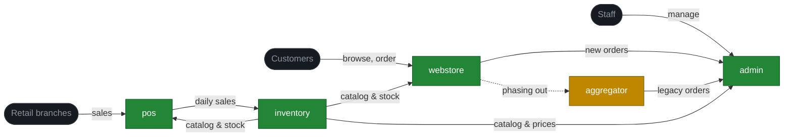

# Case study — Acme E-commerce

A **fully fictional** e-commerce ecosystem, used as the running example throughout VaultMesh's docs. Acme is a small online retailer with five services on three servers. Every name, number, and detail in this folder is invented. Use it as a model for what your own vault might look like after a few months of real use.

## The ecosystem

| App | Role | Server | Stack (fictional) |
|---|---|---|---|
| `webstore` | Customer-facing storefront | 1 | Node.js + Postgres |
| `admin` | Back-office for catalog, orders, customers | 1 | Rails + Postgres (shared) |
| `inventory` | Single source of truth for stock and pricing | 2 | Python + Postgres |
| `pos` | In-store point-of-sale (one instance per branch, syncs to inventory) | 3 | Python + SQLite local |
| `aggregator` | Legacy order hub being phased out | 2 | PHP + MySQL |

## What's in this folder

- [`architecture.md`](architecture.md) — apps × servers map and the integration list with one-paragraph descriptions.
- [`claude-md/`](claude-md/) — per-app `CLAUDE.md` files, fully populated. These are what `setup-server.sh` would drop into each app's working directory.
- [`wiki-snapshot/`](wiki-snapshot/) — what the vault would look like after several months of real use.

The `wiki-snapshot/` folder is the centerpiece. Read it like a real vault — start with `index.md`, scan the recent entries in `log.md`, then dive into whatever catches your eye.

## Reading order

If you've never seen a populated VaultMesh vault before, this is a good order:

1. **[`wiki-snapshot/index.md`](wiki-snapshot/index.md)** — see the shape.
2. **[`wiki-snapshot/log.md`](wiki-snapshot/log.md)** — see what's been happening lately. Read the top 10 entries.
3. **[`wiki-snapshot/apps/inventory/README.md`](wiki-snapshot/apps/inventory/README.md)** — a fairly complete app page. See the shape of an entity.
4. **[`wiki-snapshot/integrations/01-inventory--pos--product-data.md`](wiki-snapshot/integrations/01-inventory--pos--product-data.md)** — a populated integration contract. Notice the producer/consumer split.
5. **[`wiki-snapshot/flows/customer-order-lifecycle.md`](wiki-snapshot/flows/customer-order-lifecycle.md)** — a cross-app journey.
6. **[`wiki-snapshot/decisions/2026-03-introduce-event-bus.md`](wiki-snapshot/decisions/2026-03-introduce-event-bus.md)** — an ADR that's been promoted from proposed to accepted.
7. **[`wiki-snapshot/apps/inventory/debugging/2026-04-stock-drift.md`](wiki-snapshot/apps/inventory/debugging/2026-04-stock-drift.md)** — a debugging page for a real-feeling incident.

By page 7, you should have a strong intuition for what the pattern feels like in motion.

## What's deliberately incomplete

A real vault after months of work would have ~50 pages, not ~15. The case study is sized to be **read in one sitting** by someone evaluating the pattern. Many module pages, runbooks, and shared docs are either stubs or absent — that's intentional. The shape is the message.

You'll also notice the `infrastructure/server-1.md` page is mostly a stub — that mirrors how real vaults grow. Engineers fill in pages on the apps and integrations they touch first; per-server pages get attention only when a server-specific incident happens.

## Adapt this to your own ecosystem

This case study is meant to be *imitated, not copied*. When you bootstrap your own vault, you'll have your own apps, your own integrations, your own log entries from real sessions. The case study just gives you a worked example of what the result looks like.

Ready to start? Read [`docs/07-adoption-guide.md`](../../docs/07-adoption-guide.md).
